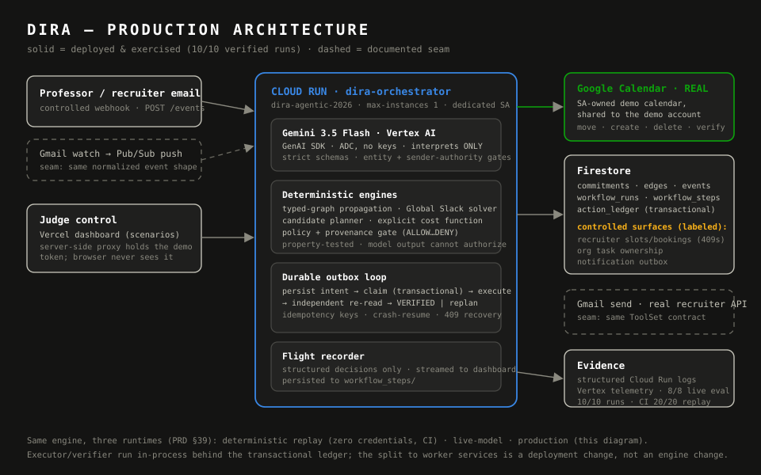

# Devpost submission — Dira

**Track:** The Taskmaster
**Tagline:** One thing changes. Everything adapts.

## Inspiration

Last term a professor moved a midterm forward by two days, and my week quietly
fell apart: the exam now collided with a recruiting interview, my prep hours no
longer fit before the test, a club deliverable I owned overlapped the new study
time, and the post-exam buffer I keep before interviews was gone. Google
Calendar and my task app both showed me the collision — in red — and then did
nothing. I spent an hour manually rebooking the interview, begging a teammate to
take the club task, and rebuilding my study plan by hand.

That is the real friction: not remembering what I have to do, but recomputing
everything *else* that breaks when one commitment moves. Every calendar assumes
the future stays still. It does not. Existing tools surface the conflict; they
do not repair the consequences. Dira is the system I wanted that night — one
that treats a schedule change as an event to *act on*, not just display.

## What it does

Dira is an autonomous commitment-repair system. It receives an external
change, maps it to a typed commitment graph, propagates the consequences,
computes whether the plan remains feasible as a formal number called Global
Slack, and then acts within explicit policy and provenance limits.

In the canonical “48-Hour Shock,” a professor moves a midterm from Friday to
Wednesday. Dira rebooks an interview using recruiter-approved availability,
recovers when the preferred slot returns a live 409, delegates a windowed
organization task to its designated backup, reclaims flexible personal time,
rebuilds the study plan, verifies each requested change with a fresh read, and
recomputes the week. Global Slack moves from +4.1h to −3.6h and then +1.3h,
with zero user interventions.

## How we built it

- **Gemini through the Google GenAI SDK on Vertex AI** performs semantic
  interpretation and entity resolution behind strict Zod schemas. It never
  performs time arithmetic or authorizes an action.
- A **typed commitment graph** carries executable edges such as
  `REQUIRES_PREPARATION`, `REQUIRES_BUFFER`, `MUST_PRECEDE`, and
  `DELEGATABLE_TO`. Propagation emits inspectable impact records.
- A deterministic **constraint engine** runs cumulative earliest-deadline
  capacity checks, window placement, buffers, and ordering constraints. Global
  Slack is the minimum margin on the most constrained path.
- The **planner** enumerates repairs from current state—available recruiter
  slots, movable blocks, progress, and delegation edges—then simulates,
  validates, and ranks them with an explicit cost function.
- A deterministic **policy and provenance gate** produces ALLOW,
  ALLOW_AND_NOTIFY, REQUIRE_APPROVAL, or DENY. No stored evidence means no
  execution.
- A **transactional action ledger** persists every intent before execution,
  supports idempotent claims, and separates `EXECUTED_UNVERIFIED` from
  `VERIFIED`. Fresh reads, not optimistic tool responses, establish success.
- The production boundary is **one Cloud Run service** using Vertex AI,
  Firestore, and a real service-account-managed Google Calendar. Recruiter
  slots, organization ownership, and outbound messages are clearly labeled
  Firestore-backed controlled integrations.
- A Next.js judge console exposes seven controlled scenarios and labels every
  run as `LIVE CLOUD`, `DETERMINISTIC EVIDENCE`, or `CLOUD UNAVAILABLE`.

## Challenges we ran into

The central challenge was making the demo resistant to scripting. The answer
was architectural: slack is derived from calendar capacity; repairs are
generated from state; and runtime variables change behavior. Move the exam to
1 PM and the interview buffer holds, so Dira correctly leaves the interview
alone. Remove both recruiter slots and Dira stops safely instead of declaring
success. Change the backup edge and a different person receives the
delegation.

The second challenge was autonomy after partial failure. A tool can succeed
and the worker can die before recording it. Dira reconciles in-flight ledger
actions by re-reading external state. A chaos test kills the run at exactly
that boundary and proves that a fresh worker finishes without double-booking.

## Accomplishments we are proud of

- 20/20 consecutive deterministic replays in CI, each recovering the injected
  409 with zero duplicate mutations and zero policy violations.
- Property-based tests over randomized graphs for slack monotonicity,
  provenance completeness, policy soundness, and plan-ranking soundness.
- Seven judge-controlled scenarios plus an eight-case CLI variation matrix;
  the repair set changes with the inputs.
- One-command, zero-credential reproduction: `make demo-replay`.
- A production security boundary that keeps the demo token server-side,
  authenticates mutation routes with constant-time comparison, restricts CORS,
  and uses application default credentials instead of checked-in keys.

## What we learned

Autonomy is earned by the “boring” parts: idempotency keys, verification
reads, provenance chains, schema boundaries, margin rules, and a visible stop
condition. The language model is valuable precisely where ambiguity exists;
the rest should be falsifiable code.

**Models interpret. Engines decide. Ledgers remember. Verifiers believe.**

## What is next

Gmail OAuth delivery, LMS and production recruiting-platform connectors,
optional Pub/Sub ingestion, multi-user coordination, and a substantive
Gemma-based risk classifier evaluated ahead of—never instead of—the
deterministic policy gate.

## Built with

TypeScript · Google GenAI SDK · Gemini · Vertex AI · Cloud Run · Firestore ·
Google Calendar API · Next.js · Vercel · Zod · fast-check · Vitest

## Links

- Repository: https://github.com/Jeremiah-Sakuda/Dira
- Interactive evidence: https://dira-phi.vercel.app
- Reliability evidence: GitHub Actions `golden-replay-20x` artifact

## Evidence boundary for judges

The overview is a deterministic reference run. The Interventions page is the
source of truth for the active runtime and displays `LIVE CLOUD` only when its
server can reach the configured Cloud Run service. In cloud mode, Calendar
operations use the real Google Calendar API; recruiter, organization, and
message actions use controlled Firestore surfaces. A Firestore message record
is not presented as a Gmail send. If the page says `DETERMINISTIC EVIDENCE`,
the orchestration and safety code is real while integration side effects are
simulated.
